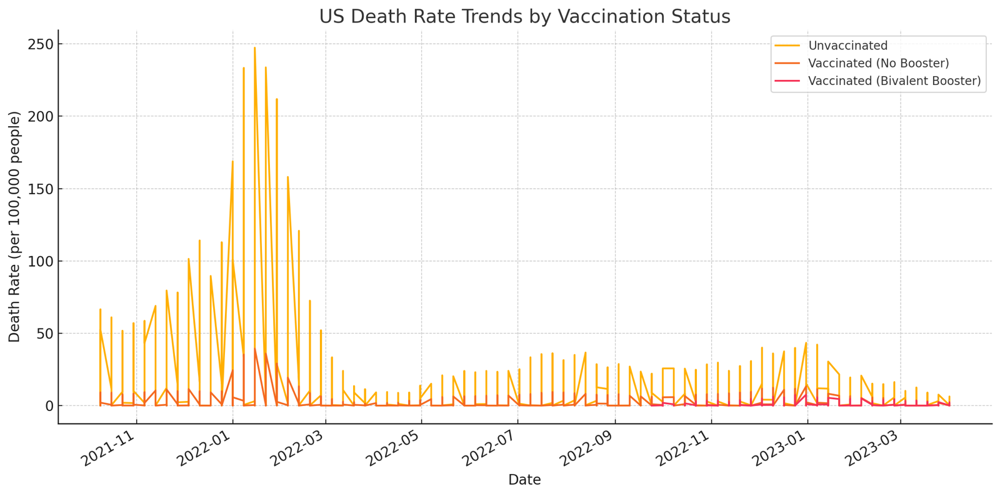
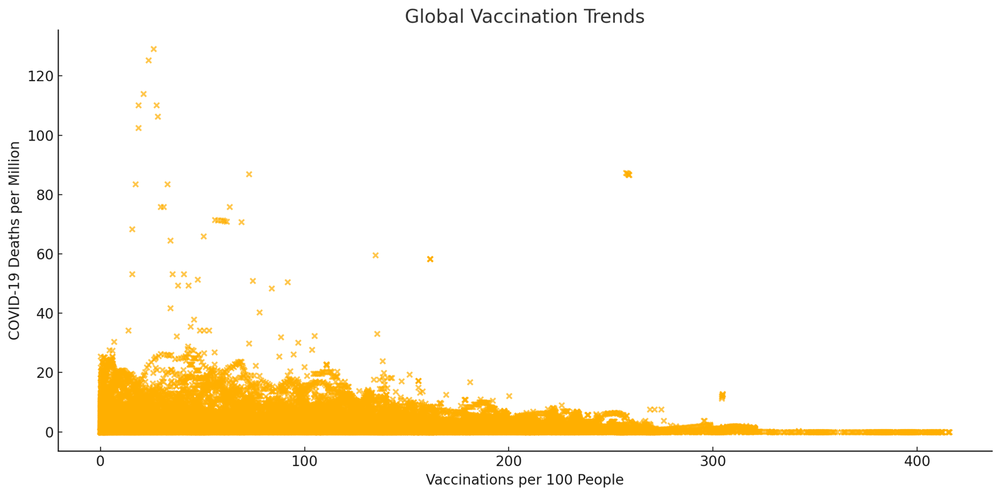
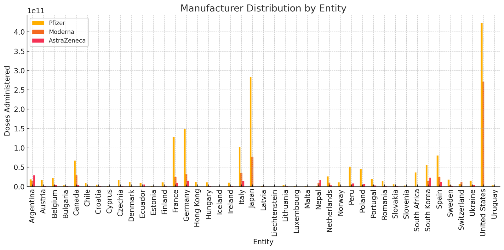

# CodeGenesis TEAM: Comprehensive COVID-19 Data Analysis

## 📖 Project Overview

This project aims to analyze the impact of vaccination on death rates during the COVID-19 pandemic, providing insights into the effectiveness of vaccines and their distribution worldwide. It combines statistical analyses, time-series evaluations, and cross-regional comparisons using rich datasets.

Key questions addressed include:
- What are the death rate trends for unvaccinated, vaccinated without boosters, and bivalent booster groups in the US?
- How do vaccination doses per 100 people vary across countries and vaccine manufacturers?
- What correlations exist between vaccination rates and death rates globally?

## 🧰 Installation and Setup

### Prerequisites
- Python 3.8+
- MongoDB (local or cloud-based instance)
- Required libraries listed in `requirements.txt`

### Installation Steps
1. **Clone the repository**:
    ```bash
    git clone https://github.com/your-username/CodeGenesisTeam.git
    cd CodeGenesisTeam
    ```

2. **Install dependencies**:
    ```bash
    pip install -r requirements.txt
    ```

3. **Configure MongoDB in `.env`**:
    ```plaintext
    MONGO_URI="your_mongo_connection_uri"
    DATABASE_NAME="codegenesis_db"
    ```

4. **Load raw data into MongoDB**:
    ```bash
    python scripts/data_to_mongo.py
    ```

5. **Begin analysis using `data_to_mongo` or `main.ipybn`**.

## 📂 Project Structure

```
CodeGenesis-TEAM/
├── data/
│   ├── raw/                 # Original datasets
│   ├── processed/           # Cleaned datasets
│
├── notebooks/               # Jupyter Notebooks for analysis
├── scripts/                 # Python scripts
├── reports/                 # Logs and final reports
│   ├── logs/                # Execution logs
│   ├── final_report.md      # Summary of findings
│
├── .env                     # MongoDB credentials
├── README.md                # Project documentation
├── requirements.txt         # Python dependencies
└── LICENSE                  # Licensing information
```

## 📊 Analytical Highlights

### 1️⃣ US Data Analysis

**Data Source**: `united-states-rates-of-covid-19-deaths-by-vaccination-status.csv`

**Key Findings**:
- **ANOVA and Tukey HSD Tests**:
  - Significant differences in death rates among unvaccinated, vaccinated without booster, and vaccinated with bivalent booster groups.
  - Post-hoc analysis revealed that unvaccinated individuals exhibited the highest death rates.
- **Time-Series and Lag Analysis**:
  - Death rates peaked during early pandemic phases and declined with vaccine rollouts.
  - Lag correlations showed weak negative associations between unvaccinated and bivalent groups.

### 2️⃣ Global Data Analysis

**Data Source**: `covid-vaccinations-vs-covid-death-rate.csv`

**Key Insights**:
- **Cumulative Vaccination Rates**:
  - Highly vaccinated countries showed reduced death rates over time.
  - Significant regional disparities in vaccination coverage.
- **Correlation Analysis**:
  - Strong negative correlation between doses per hundred and death rates.

### 3️⃣ Manufacturer Data Analysis

**Data Source**: `covid-vaccine-doses-by-manufacturer.csv`

**Highlights**:
- Pfizer and Moderna accounted for the majority of administered doses globally.
- AstraZeneca had a stronger presence in low-to-middle-income countries.
- Stacked bar plots visualized manufacturer contributions by region.

## 🛠️ Key Features and Scripts

1. **Data Cleaning and Loading**
   - **Script**: `data_to_mongo.py`
   - Ensures raw datasets are cleaned and structured for MongoDB ingestion.

2. **Statistical Analysis**
   - Implements:
     - T-tests: Comparing two groups (e.g., unvaccinated vs. bivalent).
     - ANOVA: Evaluating differences across three groups.
     - Post-hoc Tests: Tukey HSD for detailed pairwise comparisons.

3. **Visualization**
   - Time-series plots and cumulative bar charts for intuitive trend analysis.

4. **Combined Analysis**
   - Cross-referencing US and global datasets for validation and synthesis.

## 📈 Sample Visualizations

1. **US Death Rate Trends**
   - Compares death rates for unvaccinated, vaccinated without boosters, and bivalent booster groups over time.
   

2. **Global Vaccination Trends**
   - Displays vaccination rates vs. death rates for various countries.
   

3. **Manufacturer Distribution**
   - Highlights Pfizer, Moderna, and AstraZeneca’s contribution globally.
   
## 🎯 Key Insights
1. Vaccination significantly reduces death rates, especially with booster doses.
2. Global vaccination distribution is uneven, emphasizing the need for equitable access.
3. Manufacturer contributions vary by region, with some focusing on high-income countries and others on emerging markets.

## 📜 License

This project is licensed under the MIT License. See the LICENSE file for details.

For further queries, feel free to open an issue in the repository.
